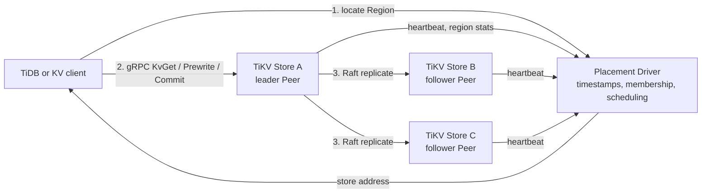
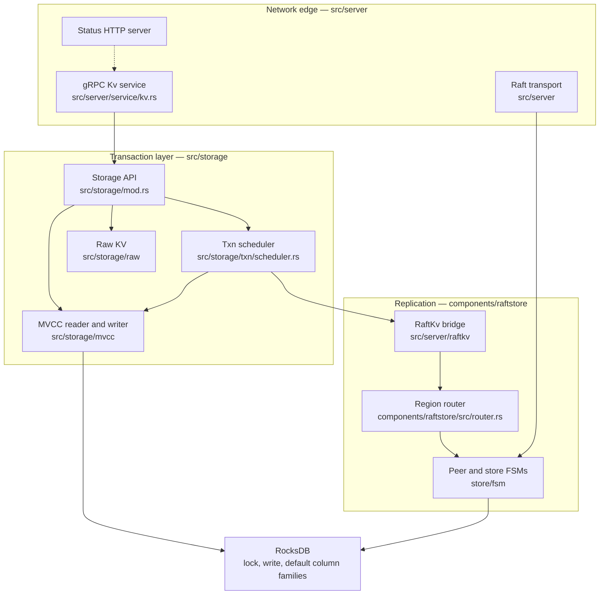
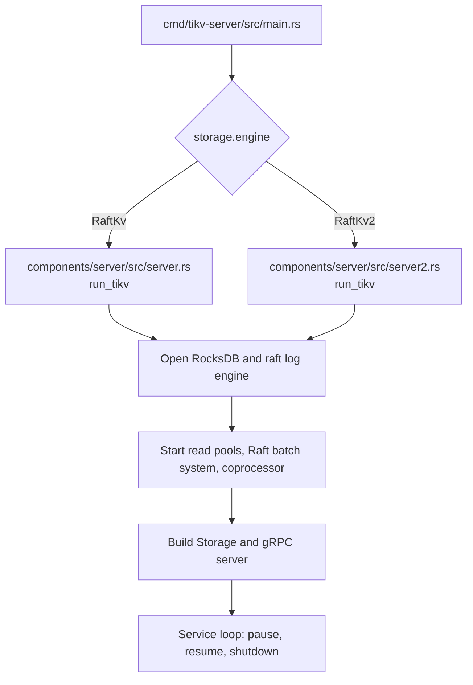
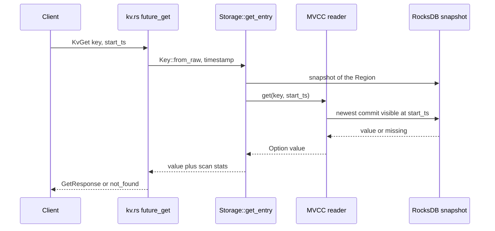
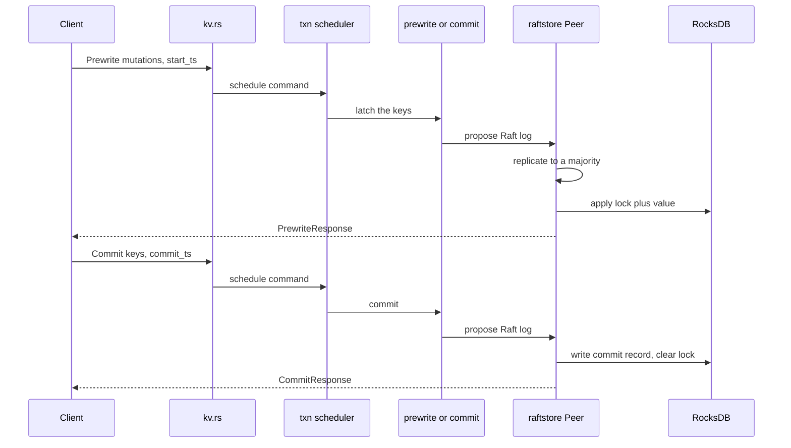

# TiKV design notes

Personal map of this repository: what the project is, which files to read first, and where a first code change should land.

## What this project is

TiKV is a distributed transactional key-value database written in Rust. A cluster is many TiKV nodes plus a Placement Driver (PD). TiDB is the usual SQL caller, but TiKV can also serve raw and transactional KV APIs on its own.

Data is split into Regions. A Region is a key range plus a Raft group. Each replica of that range is a Peer on one Store. RocksDB holds the data on disk. Raft (in `components/raftstore`) copies each write to a majority before it is applied.

Transactions follow a Percolator-style model: prewrite, then commit, with multi-version concurrency control (MVCC). A read at `start_ts` sees only versions committed before that timestamp. Old versions are removed later by garbage collection.

Two storage engines exist:

- `EngineType::RaftKv` is the classic path. Learn this one first.
- `EngineType::RaftKv2` is the newer tablet path (`partitioned-raft-kv`). It has a parallel startup file and a parallel raftstore.


## How it works

Three pictures cover the system: the cluster, one node's startup, and one request. The classic engine (`EngineType::RaftKv`) is the path drawn below.

### Cluster

A client never picks a disk. It asks PD which TiKV store leads the Region that owns the key. Each Region is one Raft group, usually three Peers on three Stores. A write is durable only after a majority of those Peers have the log entry.




PD is a separate repository. This repo is one Store: the process that holds Peers and answers gRPC.

### Inside one Store




Reads and writes split after `Storage`:

- A Get takes a snapshot and calls the MVCC reader. It does not append a Raft log entry.
- A Prewrite or Commit goes through the scheduler, then Raft. The leader replicates the log. After a majority acknowledges it, the Peer applies the entry into RocksDB.


### Startup

Startup is not on the request path. `cmd/tikv-server/src/main.rs` parses flags, checks config, then calls `run_tikv`. The classic function is `components/server/src/server.rs`. The tablet engine uses `components/server/src/server2.rs` instead.




### Read: KvGet




A point Get often skips a full Raft round trip. The leader check that allows that local read still lives in `components/raftstore`.

### Write: prewrite then commit

One SQL statement is two RPCs. Prewrite hides the new value behind a lock. Commit removes the lock and publishes the version. Both RPCs go through Raft.




After commit, a later Get with `start_ts >= commit_ts` can see the value. A Get with an earlier `start_ts` still sees the previous version. That visibility rule is what `src/storage/mvcc/reader/reader.rs` implements.

## Build notes (macOS Apple Silicon)

Personal log of what actually worked on this machine while learning the repo.
Machine: macOS (darwin aarch64), Homebrew CMake **4.2.1**.

### What worked

Build the server with the CMake 4 policy workaround:

```bash
CMAKE_POLICY_VERSION_MINIMUM=3.5 make build
```

Or export it once per shell, then build:

```bash
export CMAKE_POLICY_VERSION_MINIMUM=3.5
make build
```

Result on this machine: `Finished dev profile ...` after roughly a few minutes (native deps like RocksDB / snappy take most of the first build).

Fast type-check without a full link (also use the same env if native crates rebuild):

```bash
CMAKE_POLICY_VERSION_MINIMUM=3.5 cargo check --all
```

### What did not work

```bash
make build
```

Failed while compiling `snappy-sys` with:

```text
CMake Error at CMakeLists.txt:1 (cmake_minimum_required):
  Compatibility with CMake < 3.5 has been removed from CMake.
```

Cause: CMake **4.x** dropped support for projects that declare `cmake_minimum_required` below 3.5. TiKV’s vendored Snappy still says `VERSION 3.1`, so a plain `make build` dies in the `snappy-sys` build script.

Also not the fix: “upgrade CMake to the latest.” That is what created the problem. You do not need a newer CMake for this error.

### Optional fallback (if the env var ever fails)

Install and use CMake 3.x instead of 4.x, for example:

```bash
brew install cmake@3.31
brew unlink cmake
brew link cmake@3.31 --force
cmake --version   # expect 3.31.x, not 4.x
make build
```

Prefer the `CMAKE_POLICY_VERSION_MINIMUM=3.5` approach first; it kept CMake 4.2.1 and still built.

### After a successful build

Binaries land under `target/` (debug by default from `make build`). Running a real cluster still needs PD; see `README.md` / `CONTRIBUTING.md`. For reading code, a successful compile is enough.

## Where to start reading

Read the docs in this order, then the code. Skip Raft until a single Get makes sense.

1. `README.md` — product picture: Region, Store, PD, Raft.
2. `doc/maintenance-guides/repo-overview.md` — which directory owns which job. The reading list at the bottom of that file is the maintainer order.
3. `CONTRIBUTING.md` — build and test commands.

Then open code in this order. Stop after step 6 and walk one Get before continuing.


| Step | File                                        | Why it is next                                                                          |
| ---- | ------------------------------------------- | --------------------------------------------------------------------------------------- |
| 1    | `cmd/tikv-server/src/main.rs`               | Process entry. CLI flags, then `run_tikv`.                                              |
| 2    | `components/server/src/server.rs`           | `run_tikv` around line 238. How a node starts.                                          |
| 3    | `src/server/mod.rs`                         | gRPC services, Raft transport, status HTTP server.                                      |
| 4    | `src/server/service/kv.rs`                  | RPC handlers. `kv_get` is wired near line 339 to `future_get` near line 1614.           |
| 5    | `src/storage/mod.rs`                        | `Storage::get` near line 615. Module comment at the top explains txn, MVCC, and raw KV. |
| 6    | `src/storage/mvcc/reader/reader.rs`         | `get` near line 79. This is where a key and a timestamp become a value.                 |
| 7    | `src/storage/txn/scheduler.rs`              | Write commands are admitted, latched, and run here.                                     |
| 8    | `src/storage/txn/commands/prewrite.rs`      | First half of a transaction.                                                            |
| 9    | `src/storage/txn/commands/commit.rs`        | Second half of a transaction.                                                           |
| 10   | `src/server/raftkv/mod.rs`                  | Bridge from storage writes into Raft.                                                   |
| 11   | `components/raftstore/src/router.rs`        | Routes a message to the Region that owns the key.                                       |
| 12   | `components/raftstore/src/store/fsm/mod.rs` | Poll loop for store and peer state machines.                                            |


`src/storage/mod.rs` is large. Read the module comment and `Storage::get`. Do not read the file from top to bottom.

Deeper maps, after the path above is familiar:

- transactions: `doc/maintenance-guides/src/storage.md`
- RPC and server: `doc/maintenance-guides/src/server.md`
- Raft: `doc/maintenance-guides/components/raftstore.md`


## Walk one Get before writing code

This is the smallest complete story in the repo.

1. A client sends `KvGet`. The handler macro in `src/server/service/kv.rs` calls `future_get`.
2. `future_get` turns the raw bytes into `Key::from_raw(...)` and the request version into a timestamp, then calls `storage.get_entry`.
3. `Storage::get` / `get_entry` in `src/storage/mod.rs` take a snapshot. Only writes committed before `start_ts` are visible.
4. The MVCC reader in `src/storage/mvcc/reader/reader.rs` looks up the key on that snapshot.
5. `future_get` writes the value into `GetResponse`, or sets `not_found`.

A point Get often does not run a full Raft round trip. Raft still decides which peer is leader and whether a local read is allowed. That decision lives under `components/raftstore`, which is why step 10 and later come after this walk.

MVCC keeps three RocksDB column families:

- `lock` — a key locked by an in-progress transaction
- `write` — commit records (which `start_ts` became which `commit_ts`)
- `default` — the actual value bytes when they are not stored inline in the write record

The test that shows this read is `test_get` in `src/storage/mvcc/reader/reader.rs` (near line 2443). The storage-level test is `test_get_put` in `src/storage/mod.rs` (near line 4513).

## Where to try implementing

Stay inside `src/storage` for the first change. That layer has a clear API, unit tests next to the logic, and it does not require changing Raft or process startup.

### Exercise 1 — read and explain (no new behavior)

On branch `learn/repo-overview`:

1. Follow the Get path in the table above.
2. Read `test_get` and `test_get_put`.
3. In your own notes, write what `start_ts` means and which column family is read first.

Run only those tests while reading:

```bash
./scripts/test test_get -- --nocapture
./scripts/test test_get_put -- --nocapture
```

`cargo check --all` is the fast compile check. `make dev` is the full format, clippy, and test run used before a pull request. It is too heavy for a first reading session.

### Exercise 2 — first code change

Add a focused unit test beside an existing one. Do not add a new RPC.

A good target is snapshot visibility in `src/storage/mvcc/reader/reader.rs`:

- same key
- two committed versions
- a Get at a timestamp between them returns the older value
- a Get after the later commit returns the newer value

Copy the setup style from `test_get` in that file. If the case is already covered, extend the assertion comments in a new test instead of duplicating it.

After that test is green, the next file to implement against is `src/storage/txn/commands/prewrite.rs`, then `commit.rs`. Read both commands and their tests before changing them. A transaction is not one write. Prewrite locks the key and records the mutation. Commit publishes it at `commit_ts`.

### Exercise 3 — a real contribution

Look for open issues labeled `status/help-wanted` on the TiKV GitHub repo. Prefer an issue that names `src/storage` or tests. Open a fresh branch from `master` for that issue, for example `storage/fix-lock-wait-timeout`. Leave `learn/repo-overview` for notes and experiments.

Pull requests in this repo need:

- a title like `storage: explain the change`
- a body line `Issue Number: ref #123` or `Issue Number: close #123`
- a commit signed with `git commit -s`


## Leave these alone at first

- `components/raftstore/src/store/peer.rs` — Region lifecycle, leadership, snapshots. Easy to break.
- `components/server/src/server.rs` startup and shutdown order — correctness depends on worker lifetime.
- `EngineType::RaftKv2` and `components/raftstore-v2` — learn the classic path before the second one.
- `src/coprocessor` — TiDB SQL pushdown (table scan, index scan, aggregation). Read it after KV Get and prewrite/commit are clear. The map is `doc/maintenance-guides/src/coprocessor.md`.


## Glossary


| Term              | Meaning in this repo                                                                              |
| ----------------- | ------------------------------------------------------------------------------------------------- |
| PD                | Cluster manager. Timestamps, scheduling, store membership. Not in this repository.                |
| Store             | One TiKV process and its disk.                                                                    |
| Region            | One key-range shard, replicated as a Raft group.                                                  |
| Peer              | One replica of a Region on one Store.                                                             |
| `start_ts`        | Read or transaction timestamp. Defines which versions are visible.                                |
| MVCC              | Many versions of one key. Readers pick the newest committed version at or before their timestamp. |
| Prewrite / commit | Two-phase transaction. Lock and write the mutation, then publish the commit.                      |
| Coprocessor       | Computation pushed down into TiKV so TiDB does not pull every row.                                |


